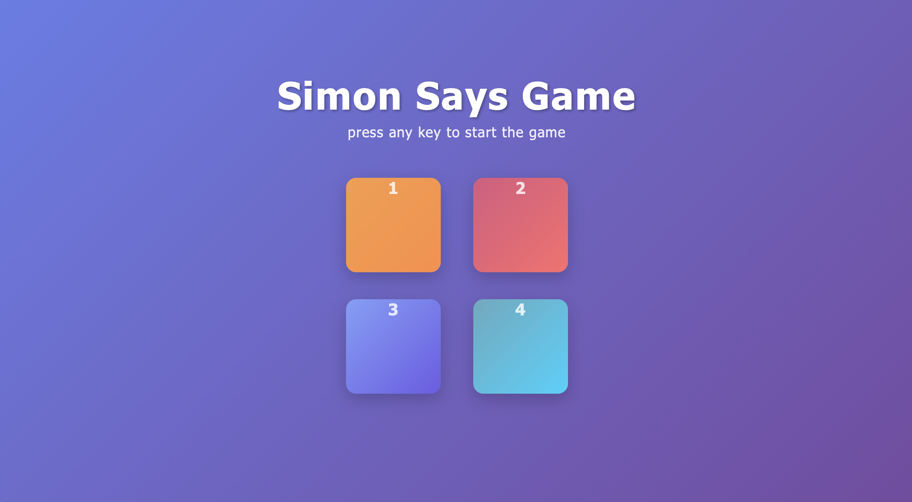
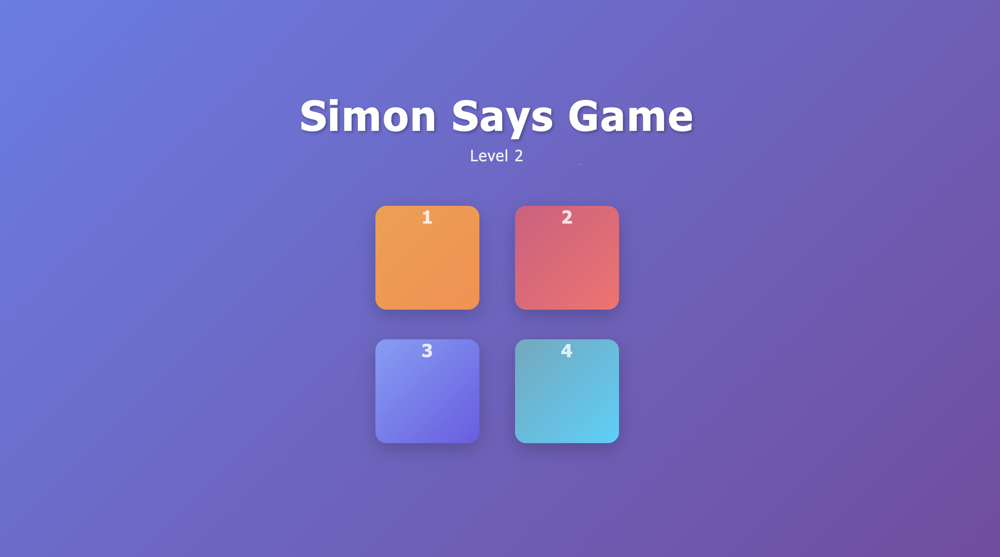
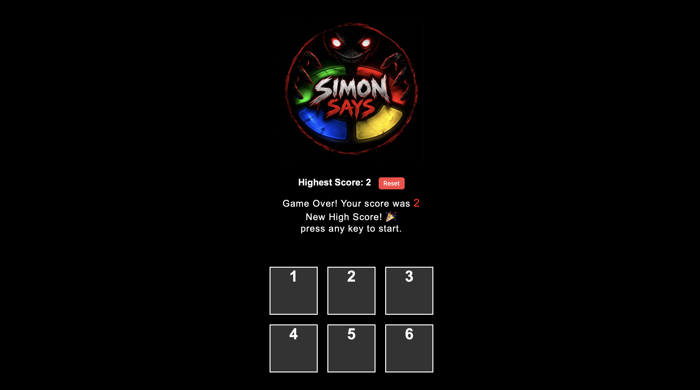

Simon Says

Simon Says is an interactive memory game designed to mimic classic electronic pattern-matching games. Built entirely from scratch, it serves as a practical frontend project to practice handling DOM manipulation, managing dynamic UI states, and handling event listeners using vanilla JavaScript. The application lets users test their memory by following increasingly complex color sequences directly within the browser without needing any external backend or framework setup.

Features

Start the game with any keypress Watch and repeat dynamic color flashes Progressive difficulty levels that track your high score and level progression

Folder Structure

index.html : HTML structure for the game board and layout
style.css : Styling and responsive animations for buttons and containers
app.js : Core game logic, sequence generation, and input tracking

How to Run

Just download the whole project folder and open index.html in your browser.

live demo
Check out the live game here: [Simon Says Live Link](https://simon-says-mauve.vercel.app/)

project screenshot

* start
  

* game play
  

* game over
  
